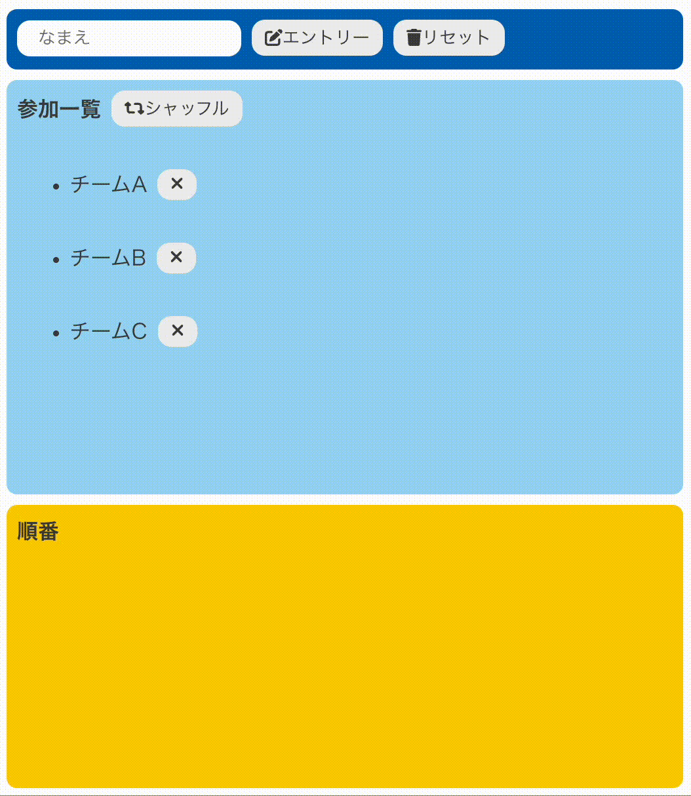

# シャッフルアプリ

入力した文字列をランダムに並び替えるアプリです。 順番を決めたいときに使えます。（React: 18.2.0 使用）




## setup
```
$ git clone git@github.com:ksbmyk/shuffle-app.git
$ cd shuffle-app
$ npm install
$ npm start
```

http://localhost:3000/ にアクセスするとアプリが表示されます。
